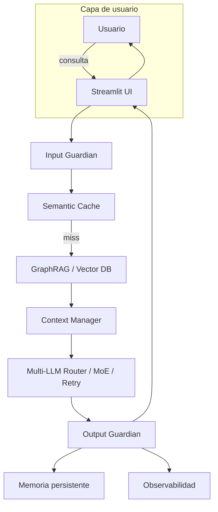
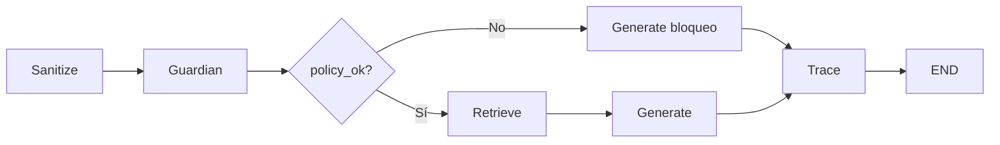
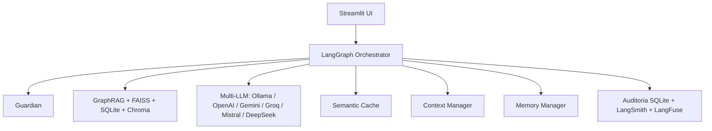
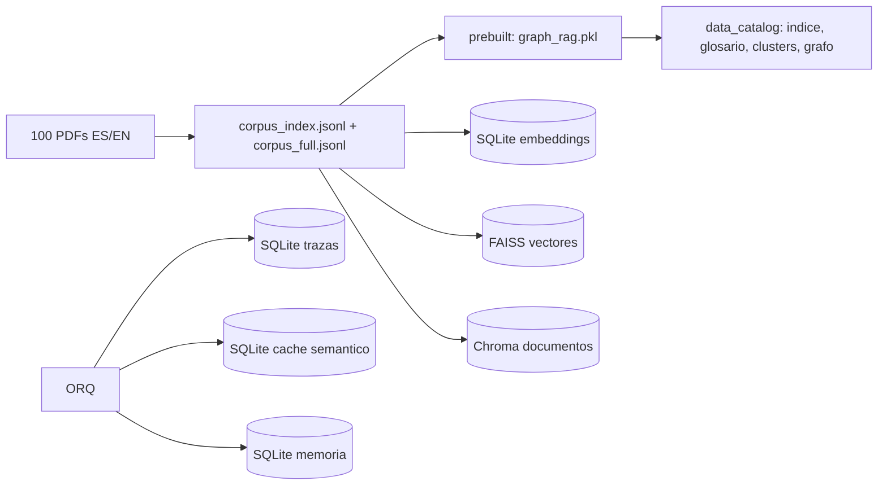
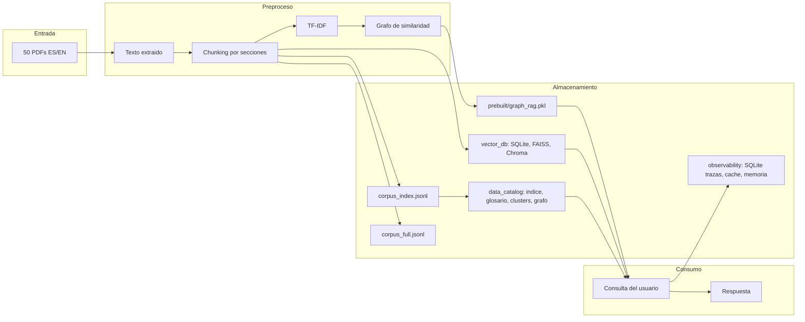
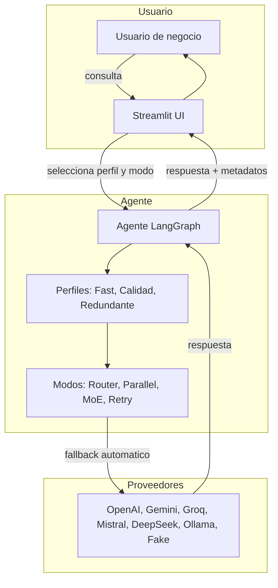
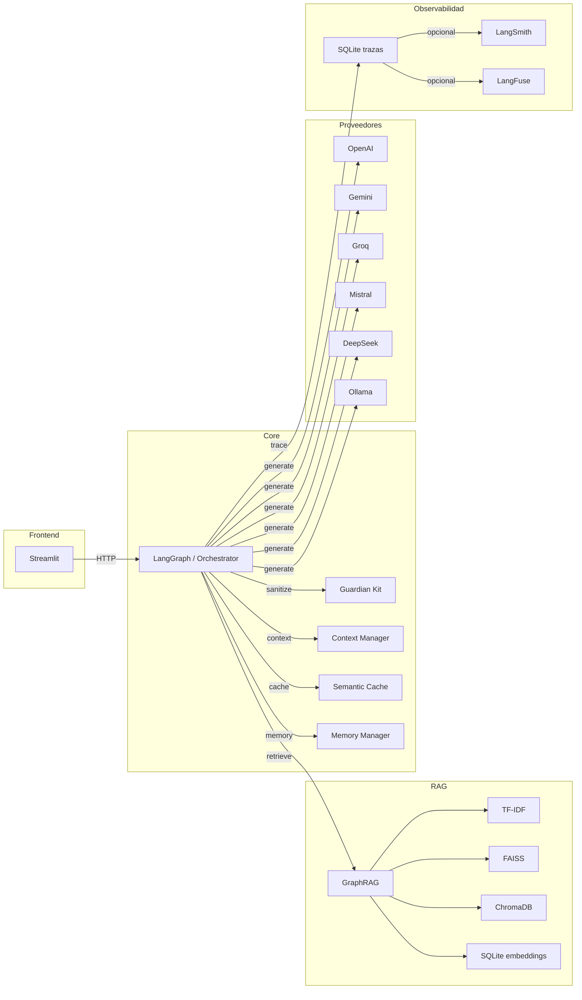
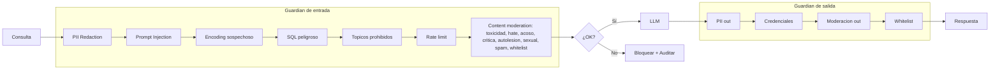
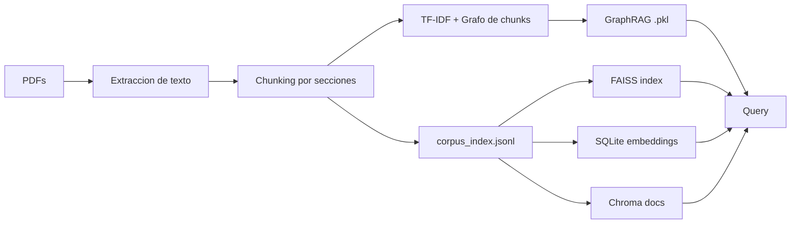
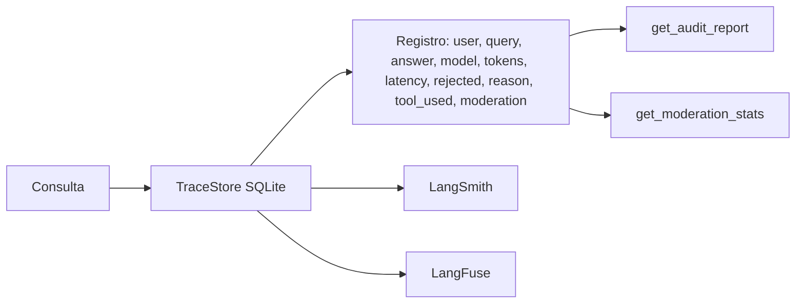

# Julian-Torres-Auxis-Agent

Agente de IA conversacional construido en Streamlit para la prueba tecnica de **Auxis** como **Desarrollador de IA / Agente**. El proyecto demuestra una arquitectura **agentic** con orquestacion **LangGraph**, multiples proveedores LLM con enrutamiento, paralelismo, Mixture-of-Experts (MoE), **GraphRAG** pre-generado, gobernanza de IA, guardrails de entrada/salida, observabilidad local y generacion de corpus en espanol e ingles.

## Tabla de contenidos

1. [Resumen](#resumen)
2. [Tecnologias principales](#tecnologias-principales)
3. [Caracteristicas](#caracteristicas)
4. [Arquitecturas](#arquitecturas)
   - [Flujo general](#flujo-general)
   - [Etapas LangGraph](#etapas-langgraph)
   - [Servicios](#servicios)
   - [Datos](#datos)
   - [Datos en detalle](#datos-en-detalle)
   - [Soluciones](#soluciones)
   - [Integraciones](#integraciones)
   - [Ciberseguridad](#ciberseguridad)
   - [RAG y vectores](#rag-y-vectores)
   - [Observabilidad](#observabilidad)
5. [Como funciona todo](#como-funciona-todo)
   - [Camino feliz](#camino-feliz)
   - [Pestana por pestana](#pestana-por-pestana)
6. [Estructura del repositorio](#estructura-del-repositorio)
7. [Instalacion local](#instalacion-local)
8. [Despliegue en Streamlit Cloud](#despliegue-en-streamlit-cloud)
9. [Configuracion de secretos](#configuracion-de-secretos)
10. [Limitaciones y consideraciones](#limitaciones-y-consideraciones)

---

## Resumen

El asistente responde consultas de negocio sobre un corpus de al menos 50 documentos PDF en espanol e ingles, organizados en los temas **economia**, **legal**, **estrategia**, **organizacional** y **datos**. La arquitectura combina:

- **GraphRAG** con chunks, grafo de similaridad TF-IDF y recuperacion hibrida.
- **Multi-LLM** con siete proveedores (OpenAI, Gemini, Groq, Mistral, DeepSeek, Ollama y un simulado).
- **LangGraph** como orquestador de los estados del agente.
- **Guardian** con deteccion de PII, prompt injection, moderacion, rate limit y mas.
- **Observabilidad** local en SQLite y opcionalmente LangSmith / LangFuse.
- **Streamlit** como interfaz unificada para consulta, RAG, catalogos, redes y arquitectura.

---

## Tecnologias principales

| Capa | Tecnologia |
|------|------------|
| UI | Streamlit |
| Orquestacion | LangGraph |
| LLMs | langchain-openai, langchain-google-genai, langchain-groq, langchain-mistralai, langchain-ollama, ChatOpenAI (DeepSeek) |
| RAG/Embeddings | scikit-learn TF-IDF, FAISS, ChromaDB, SQLite |
| Corpus | fpdf2, NetworkX, pyvis |
| Gobernanza | Modulos personalizados guardian, pii_guard, prompt_guard |
| Observabilidad | SQLite, langsmith, langfuse |
| Lenguaje | Python 3.10+ |

---

## Caracteristicas

- **Multi-proveedor LLM**: openai, gemini, groq, mistral, deepseek, ollama, fake.
- **Modos de generacion**: Router, Parallel, MoE y Retry con maximo de reintentos.
- **Perfiles de agente**: Fast, Calidad (MoE), Redundante (Parallel).
- **GraphRAG pre-generado**: carga `prebuilt/graph_rag.pkl` para arrancar sin frio.
- **Catalogos y metadatos**: indice de documentos, diccionario de datos, glosario, inventario de metadatos, tabla jerarquica, clusters y grafo persistente.
- **Guardian de entrada**: PII, injection, encoding sospechoso, SQL peligroso, topicos prohibidos, rate limit, moderacion de contenido.
- **Guardian de salida**: PII, credenciales, moderacion, whitelist.
- **Cache semantico**: exact/semantico, TTL y estadisticas.
- **Memoria persistente**: cache, sesion, knowledge-store y checkpoints.
- **Observabilidad**: trazas SQLite con `get_audit_report()` y `get_moderation_stats()`.
- **Diagramas de arquitectura** en Mermaid.js visibles dentro de Streamlit.

---

## Arquitecturas

Cada diagrama es visible en la pestana **Arquitectura** de la aplicacion Streamlit y se puede seleccionar desde un menu desplegable. A continuacion se explica cada uno junto con su codigo Mermaid.

### Flujo general

**Que muestra:** el flujo completo de una consulta, desde el usuario hasta la respuesta, pasando por guardian, cache semantico, GraphRAG, context manager, multi-LLM y observabilidad.



### Etapas LangGraph

**Que muestra:** los nodos del grafo de LangGraph (sanitize, guardian, retrieve, generate, trace) y como decide si bloquear o continuar segun `policy_ok`.



### Servicios

**Que muestra:** los principales componentes del backend y como Streamlit se comunica con el orquestador, el guardian, el RAG, el multi-LLM, la cache, la memoria y la auditoria.



### Datos

**Que muestra:** el flujo de datos pre-generados y persistentes: PDFs, indices JSONL, GraphRAG, catalogos y las distintas bases de datos vectoriales y SQLite.



### Datos en detalle

**Que muestra:** el procesamiento completo desde los 50 PDFs hasta el consumo por parte del usuario, incluyendo chunking, TF-IDF, creacion del grafo, almacenamiento en corpus_index, corpus_full, data_catalog, vector_db y observabilidad.



### Soluciones

**Que muestra:** la arquitectura orientada a soluciones del usuario: perfil del agente, modos de generacion, proveedores y fallback automatico entre ellos.



### Integraciones

**Que muestra:** como se conectan los componentes internos con los proveedores LLM y con las herramientas de observabilidad.



### Ciberseguridad

**Que muestra:** las capas de guardrails de entrada (PII, injection, moderacion, rate limit, etc.) y de salida (PII, credenciales, moderacion, whitelist).



### RAG y vectores

**Que muestra:** como el texto de los PDFs se convierte en chunks, indices, grafo TF-IDF, FAISS, SQLite y Chroma para ser consultados.



### Observabilidad

**Que muestra:** el flujo de trazas a SQLite y opcionalmente a LangSmith/LangFuse, con los reportes de auditoria y estadisticas de moderacion.



---

## Como funciona todo

### Camino feliz

1. **Abrir la app** en Streamlit Cloud o local.
2. **Seleccionar un perfil** en el sidebar (`Fast`, `Calidad`, `Redundante`) o dejar `Personalizado`.
3. **Seleccionar los proveedores activos** en el sidebar (`openai`, `gemini`, `groq`, `mistral`, `deepseek`, `ollama`).
4. **Si hay mas de un proveedor y modo `router`**, elegir el proveedor para router en el desplegable.
5. **Seleccionar el modo de generacion** (`router`, `parallel`, `moe`, `retry`).
6. **Ajustar los reintentos** si se usa `moe` o `retry`.
7. **Escribir la consulta** en el tab **Consulta**.
8. **Presionar `Ejecutar agente`**.
9. **Esperar la respuesta** en el tab **Consulta**.
10. **Explorar el resto de pestanas** para ver trazas, RAG, catalogos, grafo y arquitectura.

### Pestana por pestana

- **Consulta**: escribe la pregunta, presiona `Ejecutar agente` y recibe la respuesta. El agente primero sanitiza, luego ejecuta guardian, recupera contexto con GraphRAG, genera con el/los LLM seleccionados y guarda la traza.
- **RAG y Grafo**: muestra los nodos, aristas y forma de la matriz TF-IDF del GraphRAG cargado. Permite probar una consulta de ejemplo y ver los chunks recuperados.
- **Gobernanza**: muestra el input guardian, las violaciones detectadas y el output guardian de la ultima consulta. Tambien permite probar la redaccion de PII.
- **Observabilidad**: consulta las trazas almacenadas, filtra por usuario y descarga el reporte de auditoria.
- **Base Vectorial**: permite indexar y consultar los almacenes vectoriales (SQLite, FAISS, Chroma).
- **Temas y Red**: muestra la distribucion de temas, la red interactiva de chunks, el grafo persistente del corpus, el indice de documentos, el diccionario de datos, el glosario, el inventario de metadatos, la tabla jerarquica y los clusters.
- **Arquitectura**: renderiza los diagramas Mermaid explicados en la seccion anterior.
- **PDFs**: genera documentos tecnicos en espanol e ingles para descargar.

### Flujo detallado del boton `Ejecutar agente`

Cuando el usuario presiona `Ejecutar agente`:

1. **Sanitize**: se quita PII de la consulta.
2. **Guardian**: se valida la consulta (injection, topicos prohibidos, moderacion, rate limit, etc.).
3. Si falla el guardian, se genera un mensaje de bloqueo con el motivo.
4. Si pasa, **Retrieve** busca chunks relevantes con GraphRAG.
5. **Generate** construye el prompt con el contexto y lo envia al/los LLM segun el modo.
6. Si el proveedor seleccionado falla (rate limit, sin saldo, modelo deprecado, etc.), el sistema prueba automaticamente los demas proveedores activos.
7. Si todos fallan, devuelve una respuesta simulada con el detalle de cada error.
8. **Trace**: se guarda la traza con usuario, consulta, respuesta, proveedor, tokens, latencia y decisiones de gobernanza.

---

## Estructura del repositorio

```
.
├── app.py                    # Aplicacion Streamlit principal
├── orchestrator.py           # Workflow LangGraph
├── llm_clients.py            # Clientes multi-LLM y fallback
├── retriever.py              # GraphRAG con TF-IDF
├── build_corpus.py           # Generacion de 50 PDFs e indices
├── data_catalog_builder.py   # Catalogos, glosarios, clusters, grafo
├── pre_build.py              # Carga y pre-generacion de assets
├── guardian_kit.py           # Input/output guardian, rate limit
├── pii_guard.py              # Deteccion y redaction de PII
├── prompt_guard.py           # Deteccion de prompt injection
├── governance.py             # Politicas de gobernanza
├── semantic_cache.py         # Cache semantico
├── context_manager.py        # Gestion de contexto y memoria
├── memory.py                 # Memoria persistente
├── observability_manager.py  # Trazas y auditoria
├── multi_store.py            # Almacenes vectoriales
├── mermaid_diagrams.py       # Diagramas de arquitectura
├── requirements.txt
├── prebuilt/
│   └── graph_rag.pkl         # RAG pre-generado
├── data_catalog/             # Catalogos, glosarios, grafo
├── corpus_index.jsonl        # Indice de chunks
└── corpus_full.jsonl         # Texto completo de documentos
```

---

## Instalacion local

1. Clonar el repositorio:
   ```bash
   git clone https://github.com/JulianTorrest/Julian-Torres-Auxis-Agent.git
   cd Julian-Torres-Auxis-Agent
   ```

2. Crear entorno virtual e instalar dependencias:
   ```bash
   python -m venv venv
   source venv/bin/activate  # Windows: venv\Scripts\activate
   pip install -r requirements.txt
   ```

3. Instalar y correr Ollama (opcional):
   - Descargar Ollama desde https://ollama.com
   - Ejecutar `ollama pull llama3.2` y `ollama pull nomic-embed-text`

4. Configurar variables de entorno:
   ```bash
   export OPENAI_API_KEY="..."
   export GEMINI_API_KEY="..."
   export GROQ_API_KEY="..."
   export MISTRAL_API_KEY="..."
   export DEEPSEEK_API_KEY="..."
   export OLLAMA_BASE_URL="http://localhost:11434"
   ```

5. Ejecutar:
   ```bash
   streamlit run app.py
   ```

---

## Despliegue en Streamlit Cloud

1. Conectar el repositorio en [Streamlit Cloud](https://streamlit.io/cloud).
2. Asegurar que el archivo principal es `app.py` y la rama es `main`.
3. En **Settings > Secrets** agregar las API keys en formato TOML:
   ```toml
   OPENAI_API_KEY = "..."
   GEMINI_API_KEY = "..."
   GROQ_API_KEY = "..."
   MISTRAL_API_KEY = "..."
   DEEPSEEK_API_KEY = "..."
   ```
4. Reiniciar la aplicacion.

---

## Configuracion de secretos

El codigo lee las keys desde variables de entorno con el patron `{PROVEEDOR}_API_KEY`:

- `OPENAI_API_KEY`
- `GEMINI_API_KEY`
- `GROQ_API_KEY`
- `MISTRAL_API_KEY`
- `DEEPSEEK_API_KEY`
- `OLLAMA_BASE_URL` (opcional, default `http://localhost:11434`)
- `LANGSMITH_API_KEY` (opcional)
- `LANGFUSE_SECRET_KEY` y `LANGFUSE_PUBLIC_KEY` (opcionales)

**No subir nunca las API keys al repositorio.**

---

## Limitaciones y consideraciones

- **Capa gratuita**: los proveedores usan keys de capa gratuita, por lo que pueden fallar por rate limits, cuota insuficiente o modelos deprecados. El agente hace fallback automatico entre los proveedores disponibles y, si todos fallan, devuelve una respuesta simulada.
- **Ollama en Streamlit Cloud**: Ollama no esta disponible en la nube; solo funciona en instalacion local.
- **Resumenes del catalogo**: los catalogos se pre-generaron sin LLM real, por lo que los resumenes aparecen como "Resumen no generado". Para generarlos con un LLM, ejecutar `data_catalog_builder.build_all(rag, llm=get_llm(["openai"], ...))`.
- **Observabilidad externa**: LangSmith y LangFuse son opcionales; sin keys la observabilidad funciona con SQLite local.
